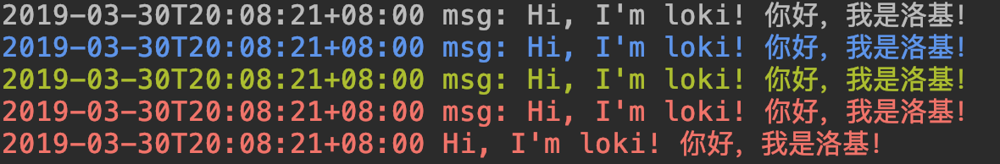

# Loki


[](https://goreportcard.com/report/github.com/joway/loki)
[](https://codecov.io/gh/joway/loki)
[](https://circleci.com/gh/joway/loki)

Inspired by a popular NodeJS logger library: [debug](https://www.npmjs.com/package/debug).

## Feature

- Out of the box
- Colorful console output
- Enable logger by environment easily



## Difference with other logger library

Sometimes, it's not enough to split loggers by different log level. 

With Loki, you can inject more detailed logs in your code, and enable them by environment variable whenever you want, which makes debug more conveniently.

## Install

```bash
go get github.com/joway/loki@latest
```

## API

[](https://godoc.org/github.com/joway/loki)

## Usage

### Use root logger

```go
// default level is INFO
loki.SetLevel(loki.DEBUG)

loki.Info("x: %s", "hi")
loki.Debug("x: %s", "hi")
loki.Error("x: %s", "hi")
```

### Create your logger

```go
logger := loki.New("app:moduleName")
logger.Info("x: %s", "hi")
logger.Debug("x: %s", "hi")
logger.Error("x: %s", "hi")
```

To enable this logger, add env `LOKI_ENV=app:moduleName` in your startup command, like: `LOKI_ENV=app:moduleName ./main`.

You can also use `LOKI_ENV=app:a,app:b,model:a` to enable multiple loggers.

`LOKI_ENV=*` can enable all loggers.

### Use file handler

```go
// "02 Jan 06 15:04 MST"
l := loki.New("app:xxx")
fp, err := os.OpenFile("test.log", os.O_WRONLY|os.O_CREATE|os.O_TRUNC, os.ModePerm)
defer fp.Close()
flushIntervalMs := 1000
l.SetHandler(loki.NewFileHandler(fp, flushIntervalMs))

l.Info("x: %s", "hi")
```

### Change time format

```go
// "02 Jan 06 15:04 MST"
loki.SetTimeFormatter(time.RFC822)

// disable time output
loki.SetTimeFormatter("")
```

### Use your custom logger formatter

```go
type ErrFormatter struct {
	loki.Formatter
}

func (f ErrFormatter) format(a ...interface{}) string {
	err := a[0].(error)
	return fmt.Sprintf("Error %v", err)
}

logger := loki.New("app:xxx")
f := ErrFormatter{}
logger.SetFormatter(f)
logger.Debug(errors.New("test error"))
```
